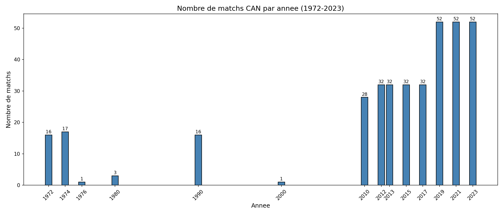
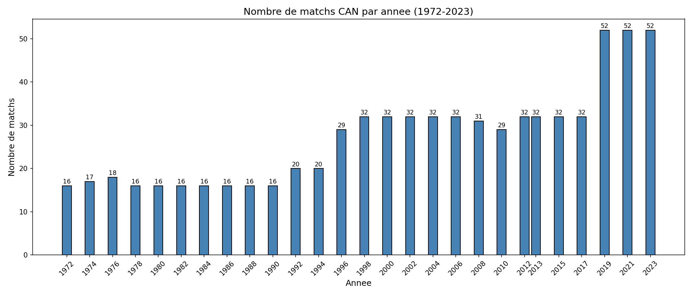
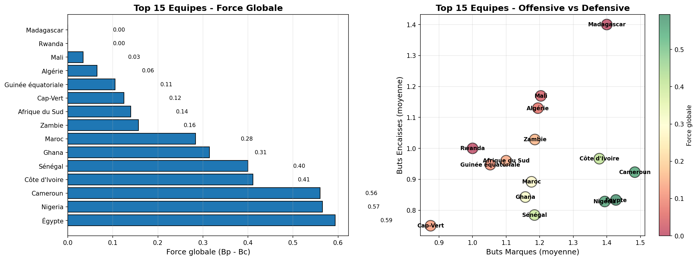

# Rapport Complet de Projet : Prédiction de la CAN 2025

## Introduction
Ce projet de Data Science a pour ambition de prédire le dénouement de la Coupe d'Afrique des Nations (CAN) 2025 qui se déroule au Maroc. En combinant l'historique des matchs internationaux de football africain et des techniques de modélisation statistique, nous avons construit un pipeline complet allant de la collecte des données brutes jusqu'à la simulation finale du tournoi.

L'objectif est d'identifier non seulement le vainqueur probable, mais aussi de simuler le parcours de chaque équipe, des phases de groupes jusqu'à la finale.

---

## Architecture et Déroulement du Projet

Le projet est structuré de manière séquentielle dans le dossier `CAN_2025`. Chaque étape critique correspond à un notebook Jupyter spécifique.

### Étape 1 : Collecte de Données (Web Scraping)
*   **Fichier :** [`1_web_scraping.ipynb`](CAN_2025/1_web_scraping.ipynb)
*   **Description Détaillée :**
    Cette première étape est cruciale pour alimenter notre modèle. Nous avons développé des scripts de scraping pour extraire les résultats des matchs de football internationaux depuis plusieurs décennies.
    *   **Sources :** Sites d'archives de football et encyclopédies en ligne (Wikipedia, RSSSF, etc.).
    *   **Données extraites :** Date du match, Équipe domicile, Équipe extérieur, Score domicile, Score extérieur, Type de compétition (Amical, CAN, Qualif Coupe du Monde, etc.).
    *   **Résultat :** Un dataset brut `can_matches.csv` contenant plusieurs milliers de matchs historiques.

---

### Étape 2 : Nettoyage et Préparation des Données
*   **Fichier :** [`2_data_cleaning.ipynb`](CAN_2025/2_data_cleaning.ipynb)
*   **Description Détaillée :**
    Les données brutes comportent souvent des erreurs ou des incohérences. Cette étape vise à garantir la qualité de la donnée.
    *   **Standardisation des noms :** Harmonisation des noms de pays qui peuvent varier selon les sources (ex: "Ivory Coast" vs "Côte d'Ivoire", "DR Congo" vs "Zaire").
    *   **Traitement des dates :** Conversion des dates en format standard datetime.
    *   **Filtrage :** Suppression des matchs avec des données manquantes ou erronées.

    **Visualisation de la distribution des données :**
    
    Ci-dessous, la distribution des matchs collectés par année avant et après correction, permettant de valider la couverture temporelle de notre dataset historique.

    
    *Figure 1 : Volume de matchs disponibles par année dans notre base de données.*

    
    *Figure 2 : Données nettoyées et prêtes pour l'analyse.*

---

### Étape 3 : Analyse de la Force des Équipes
*   **Fichier :** [`3_team_strength.ipynb`](CAN_2025/3_team_strength.ipynb)
*   **Description Détaillée :**
    C'est le cœur de notre moteur de prédiction. Nous calculons ici la "Force" (Strength) offensive et défensive de chaque nation qualifiée.
    *   **Métriques Calculées :** Moyenne de buts marqués (Attaque) et encaissés (Défense).
    *   **Pondération :** Les matchs récents ont un poids plus important que les anciens matchs pour refléter la forme actuelle de l'équipe.
    *   **Comparaison :** Nous comparons chaque équipe par rapport à la moyenne du continent.

    **Aperçu des forces en présence :**

    
    *Figure 3 : Comparaison des métriques offensives et défensives des principales équipes.*

---

### Étape 4 : Simulation de la Phase de Groupes
*   **Fichier :** [`4_group_simulation.ipynb`](CAN_2025/4_group_simulation.ipynb)
*   **Description Détaillée :**
    Nous reproduisons ici le tirage au sort officiel de la CAN 2025. Pour chaque match de poule :
    *   Nous utilisons la **Loi de Poisson** pour prédire les scores probables basés sur la force offensive de l'équipe A et la force défensive de l'équipe B.
    *   Le classement est mis à jour en temps réel (Victoire = 3 pts, Nul = 1 pt).
    *   Les règles officielles de la CAF sont appliquées pour déterminer les qualifiés (les 2 premiers + les 4 meilleurs troisièmes).

---

### Étape 5 : Prédiction des Phases à Élimination Directe (Knockout)
*   **Fichier :** [`5_knockout_prediction.ipynb`](CAN_2025/5_knockout_prediction.ipynb)
*   **Description Détaillée :**
    Une fois les 16 équipes qualifiées connues, nous simulons l'arbre final : Huitièmes -> Quarts -> Demies -> Finale.
    *   Intégration de la logique de prolongation et de tirs au but en cas d'égalité probabliste.
    *   Calcul des probabilités de qualification pas à pas pour chaque match.

---

### Étape 6 : Résultats Finaux et Visualisation
*   **Fichier :** [`6_final_results.ipynb`](CAN_2025/6_final_results.ipynb)
*   **Description Détaillée :**
    Ce dernier notebook agrège tous les résultats pour présenter :
    1.  Le grand vainqueur simulé.
    2.  Le podium complet (1ère, 2ème et 3ème place).
    3.  Une analyse des statistiques clés du tournoi simulé.

---

## Installation et Exécution

Pour reproduire cette étude sur votre machine locale :

1.  Assurez-vous d'avoir Python installé.
2.  Installez les dépendances nécessaires :
    ```bash
    pip install -r requirements.txt
    ```
    *(Note : Si vous utilisez `uv` ou `poetry`, référez-vous au `pyproject.toml`)*
3.  Lancez Jupyter Notebook :
    ```bash
    jupyter notebook
    ```
4.  Exécutez les notebooks dans l'ordre de 1 à 6.

## Structure des Données (`data/`)

*   `can_matches.csv` : Données historiques brutes.
*   `can_matches_cleaned_final.csv` : Données nettoyées servant à l'entraînement.
*   `can_matches_2025.csv` : Calendrier officiel de la CAN 2025.
*   `final_podium.csv` : Fichier de sortie contenant les prédictions finales.
