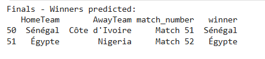
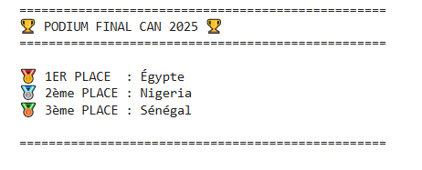

# Rapport Complet de Projet : Prédiction de la CAN 2025

## Introduction
Ce projet de Data Science a pour ambition de prédire le dénouement de la Coupe d'Afrique des Nations (CAN) 2025 qui se déroule au Maroc. En combinant l'historique des matchs internationaux de football africain et des techniques de modélisation statistique, nous avons construit un pipeline complet allant de la collecte des données brutes jusqu'à la simulation finale du tournoi.

L'objectif est d'identifier non seulement le vainqueur probable, mais aussi de simuler le parcours de chaque équipe, des phases de groupes jusqu'à la finale.

---

## Architecture du Projet

Voici l'arborescence des fichiers du projet :

```text
CAN_2025/
├── 1_web_scraping.ipynb        # Scrapping des données
├── 2_data_cleaning.ipynb       # Nettoyage des données
├── 3_team_strength.ipynb       # Analyse des forces
├── 4_group_simulation.ipynb    # Simulation des groupes
├── 5_knockout_prediction.ipynb # Phase à élimination directe
├── 6_final_results.ipynb       # Résultats finaux
├── data/                       # Dossier des datasets
└── images/                     # Dossier des visualisations
```

## Déroulement du Projet

Le projet est structuré de manière séquentielle dans le dossier `CAN_2025`. Chaque étape critique correspond à un notebook Jupyter spécifique.

### Étape 1 : Collecte de Données (Web Scraping)
*   **Fichier :** [`1_web_scraping.ipynb`](CAN_2025/1_web_scraping.ipynb)
*   **Description Détaillée :**
    Cette première étape est cruciale pour alimenter notre modèle. Nous avons développé des scripts de scraping pour extraire les résultats des matchs de football internationaux depuis plusieurs décennies.
    *   **Sources :** Wikipedia
    *   **Données extraites :** Date du match, Équipe domicile, Équipe extérieur, Score domicile, Score extérieur, Terrain.
    *   **Résultat :** Un dataset brut `can_matches.csv` contenant les matchs de toutes les éditions du CAN.
*   **Visualisation de la distribution des données et Challenge Technique :**
    
    Lors de la phase initiale de scraping, nous avons rencontré un défi technique majeur qui affectait la récupération des scores.

    *   **Problème Identifié :** Le scraping ne retournait aucun match pour certaines périodes car la condition de détection du score échouait.
    *   **Cause :** Wikipedia utilise le caractère **EN DASH – (U+2013)** dans les scores (ex: `2 – 1`), alors que le code cherchait le tiret standard **ASCII - (U+002D)**. Ces deux caractères sont visuellement similaires mais informatiquement différents ("–" != "-").
    *   **Solution :** L'ajout de la ligne `score_text = score_text.replace("–", "-")` a permis de convertir le EN DASH en tiret ASCII avant le parsing.

    Les graphiques ci-dessous illustrent l'impact de cette correction sur la quantité de données récupérées :

    
    *Figure 1 : Volume de matchs disponibles par année dans notre base de données.*

    
    *Figure 2 : Données nettoyées et prêtes pour l'analyse.*

---

### Étape 2 : Nettoyage et Préparation des Données
*   **Fichier :** [`2_data_cleaning.ipynb`](CAN_2025/2_data_cleaning.ipynb)
*   **Description Détaillée :**
    Cette étape transforme les données brutes issues du scraping en un dataset propre et structuré, prêt pour la modélisation.
    *   **Restructuration du Dataset :** Création d'un nouveau DataFrame conservant uniquement les colonnes essentielles (`HomeTeam`, `AwayTeam`, `Year`, `HomeGoals`, `AwayGoals`).
    *   **Nettoyage des Scores :** Traitement algorithmique pour extraire les scores numériques des chaînes complexes (ex: "2 a. p.") et application de corrections manuelles ciblées sur les entrées invalides détectées.
    *   **Filtrage des "Faux" Équipes :** Identification et élimination des entrées parasites générées par le scraping (ex: "Vainqueur", "Second", "Perdant").
    *   **Harmonisation des Noms :** Algorithme de correction itératif pour standardiser les noms d'équipes (Home/Away) en se basant sur une liste de références uniques, corrigeant ainsi les variations mineures.
    *   **Feature Engineering :** Calcul de la variable `TotalGoals` (HomeGoals + AwayGoals).

---

### Étape 3 : Analyse de la Force des Équipes
*   **Fichier :** [`3_team_strength.ipynb`](CAN_2025/3_team_strength.ipynb)
*   **Description Détaillée :**
    C'est le cœur de notre moteur de prédiction. Nous calculons ici la "Force" (Strength) offensive et défensive de chaque nation qualifiée.
    *   **Métriques Calculées :** Moyenne de buts marqués (Attaque) et encaissés (Défense).
    
    *   **Comparaison :** Nous comparons chaque équipe par rapport à la moyenne du continent.

    **Aperçu des forces en présence :**

    
    *Figure 3 : Comparaison des métriques offensives et défensives des principales équipes.*

---

### Étape 4 : Simulation de la Phase de Groupes
*   **Fichier :** [`4_group_simulation.ipynb`](CAN_2025/4_group_simulation.ipynb)
*   **Description Détaillée :**
    Nous reproduisons ici le tirage au sort officiel de la CAN 2025. Pour chaque match de poule :
    *   Nous utilisons la **Loi de Poisson** pour prédire les scores probables basés sur la force offensive de l'équipe A et la force défensive de l'équipe B.
    *   Le classement est mis à jour en temps réel (Victoire = 3 pts, Nul = 1 pt).
    *   Les règles officielles de la CAF sont appliquées pour déterminer les qualifiés (les 2 premiers + les 4 meilleurs troisièmes).

    **Résultat de la simulation des groupes :**

    
    *Figure 4 : Classement simulé des groupes et identification des équipes qualifiées(Groupe-A).*

---

### Étape 5 : Prédiction des Phases à Élimination Directe (Knockout)
*   **Fichier :** [`5_knockout_prediction.ipynb`](CAN_2025/5_knockout_prediction.ipynb)
*   **Description Détaillée :**
    Cette étape simule le tableau final du tournoi, des huitièmes de finale jusqu'au sacre.
    *   **Mapping des Qualifiés :** Remplacement dynamique des placeholders (ex: "1er Groupe A", "Meilleur 3ème") par les véritables équipes qualifiées.
    *   **Moteur de Prédiction :** Détermination du vainqueur de chaque match via la **Distribution de Poisson**, en calculant l'espérance de points (probabilités pondérées de victoire).
    *   **Simulation en Cascade :** Propagation automatique des vainqueurs tour par tour : Huitièmes ➡️ Quarts ➡️ Demies ➡️ Finale.

    **Résultats de la simulation :**

    Dès les huitièmes de finale, le modèle a prédit les vainqueurs suivants :
    
    *Figure 5 : Tableau des prédictions pour les huitièmes de finale.*

    L'aboutissement de la simulation avec les finalistes et le vainqueur prédit :
    
    *Figure 6 : Prédiction des matchs de la finale et de la 3ème place.*

---

### Étape 6 : Résultats Finaux et Visualisation
*   **Fichier :** [`6_final_results.ipynb`](CAN_2025/6_final_results.ipynb)
*   **Description Détaillée :**
    Ce dernier notebook agrège tous les résultats pour présenter :
    1.  Le grand vainqueur simulé.
    2.  Le podium complet (1ère, 2ème et 3ème place).
    3.  Une analyse des statistiques clés du tournoi simulé.

    **🏆 Le Verdict Final :**

    Au terme de plusieurs simulations et d'analyses match par match, le modèle a trouvé :
    
    *Figure 7 : Podium final prédit de la CAN 2025 – Égypte Vainqueur.*

---

## Conclusion et Limites du Modèle

Ce projet démontre la puissance de l'analyse de données pour anticiper les résultats sportifs. Toutefois, comme tout modèle prédictif basé sur l'historique, il comporte certaines limites intrinsèques :

1.  **L'Aléa Sportif :** Le modèle statistique (Loi de Poisson) lisse la réalité. Il ne peut pas prédire les faits de jeu imprévisibles (cartons rouges, blessures de dernière minute, erreurs d'arbitrage) qui changent souvent le cours d'un match.
2.  **Facteur Humain & Forme du Moment :** Le calcul de la "Force" est basé sur l'historique. Il ne capture pas pleinement la dynamique instantanée d'un groupe ou l'impact d'un nouveau joueur efficace.
3.  **Conditions Spécifiques (CAN Maroc) :** Jouer à domicile est un avantage, mais l'ambiance d'une CAN au Maroc peut transformer le mental des équipes (pression ou motivation extrême). Cela ne se calcule pas avec des chiffres.

Malgré ces réserves, ce pipeline offre une analyse objective et robuste des rapports de force en présence avant le coup d'envoi.

